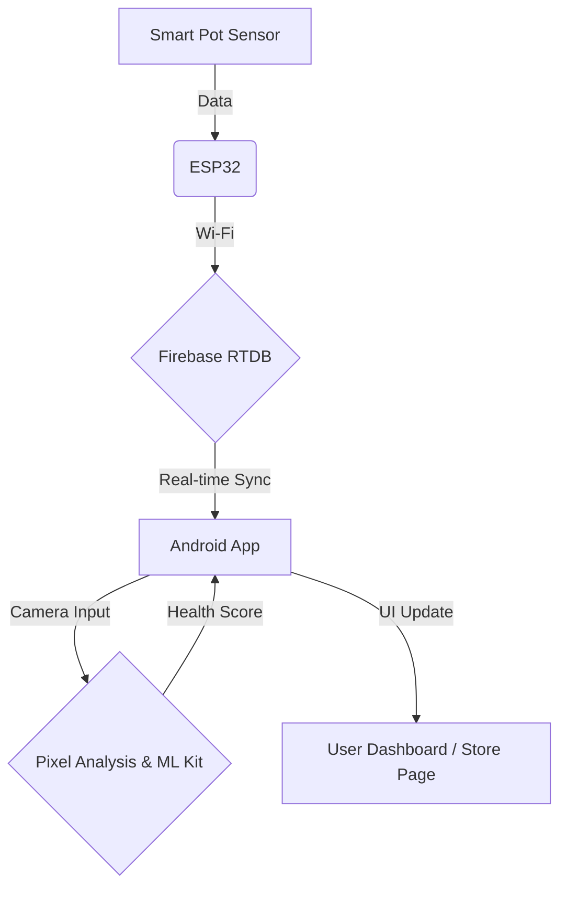

# 🌿 SmartPot: AI & IoT 기반 지능형 반려식물 관리 솔루션

> **"식물과의 정서적 교감을 데이터와 AI로 연결하다"**
>
> SmartPot은 현대인의 정서적 안정과 체계적인 식물 관리를 위해 **AI 감정 인식**, **IoT 실시간 모니터링**, **픽셀 기반 식물 진단** 기술을 결합한 통합 가드닝 플랫폼입니다.

---

## 📺 Project Overview
*   **개발 기간:** 2024.xx - 2024.xx (고도화 진행 중)
*   **주요 목표:** 
    1.  IoT 센서를 통한 데이터 기반의 정밀한 식물 환경 관리
    2.  AI를 활용한 사용자의 심리 상태 케어 및 식물과의 인터랙션
    3.  픽셀 분석 및 ML 모델을 활용한 객관적 식물 건강 진단

---

## 🚀 Key Features

### 1. AI Plant Health Scanner (스토어 페이지 통합 진단)
*   **Feature:** 스토어 페이지 접속 시 후면 카메라를 통해 식물 상태를 즉석에서 정밀 스캔.
*   **Tech:** CameraX, ML Kit Image Labeling, Pixel-level Color Analysis.
*   **Logic:** 
    *   **Object Identification:** ML Kit을 사용하여 카메라 속 피사체가 식물인지 우선 식별.
    *   **Pixel Analysis:** 비트맵 데이터의 RGB 채널 중 녹색(Green) 비중을 전수 조사하여 0~100점의 건강 점수 산출.
    *   **Interactive UX:** 시각적 피드백을 위한 플래시 효과 및 2초간의 정밀 스캔 애니메이션 제공.

### 2. AI Emotion-Sync (사용자 감정 교감)
*   **Feature:** 전면 카메라를 통해 사용자의 얼굴 표정을 분석하여 현재 기분 파악.
*   **Tech:** Google ML Kit Face Detection.
*   **Impact:** 사용자의 웃음 지수에 따라 식물이 응원의 메시지를 보내거나 함께 기뻐하는 인터랙션 UI 제공.

### 3. IoT Real-time Dashboard (실시간 환경 데이터)
*   **Feature:** 화분의 온도, 토양 습도 데이터를 실시간 동기화.
*   **Tech:** Firebase Realtime Database (with Demo Mode), MPAndroidChart.
*   **Impact:** 네트워크 부재 시에도 가상 데이터를 생성하는 데모 모드를 포함하여 상시 시연 가능.

### 4. Bluetooth & Network Setup
*   **Feature:** ESP32 하드웨어와의 페어링 및 Wi-Fi 설정 정보 전송.
*   **Tech:** Bluetooth Classic (RfcommSocket).

---

## 🛠 Tech Stack

| Category | Technology |
| --- | --- |
| **Language** | Kotlin |
| **Architecture** | MVVM Pattern |
| **Computer Vision** | ML Kit (Face Detection, Image Labeling), Pixel-level Color Analysis |
| **IoT/Backend** | Firebase Realtime Database, Bluetooth Classic |
| **Jetpack** | CameraX, ViewBinding, ViewModel, LiveData |

---

## 🏗 System Architecture

---

## 💡 Technical Challenges & Solutions

*   **실시간 객체 인식 UI 안정화 (Label Throttling):** 초당 수십 프레임씩 변하는 ML Kit의 인식 결과로 인한 UI 깜빡임과 사용자 눈의 피로를 해결하기 위해, **'타임 기반 업데이트 스로틀링(1.5초 주기)'** 로직을 적용했습니다. 이를 통해 안정적인 정보 전달과 쾌적한 UX를 동시에 확보했습니다.
*   **컴퓨터 비전을 활용한 객관적 진단 로직:** 단순 이미지 분류를 넘어, 비트맵의 픽셀 데이터를 직접 제어하여 녹색 채널(G-Channel)의 분포도를 수치화하는 알고리즘을 구현했습니다. 이를 통해 사용자에게 객관적인 건강 지표를 제공합니다.
*   **성능 최적화 (Pixel Sampling):** 고해상도 이미지 전수 조사 시 발생하는 CPU 부하를 방지하기 위해 '픽셀 샘플링(Step-sampling)' 기법을 적용, 실시간 분석 중에도 프레임 드랍 없는 부드러운 환경을 구축했습니다.
*   **사용자 피드백 최적화 (Visual Feedback):** 불필요한 청각적 피드백(셔터음)을 제거하여 공공장소 사용성을 높였으며, 대신 시각적 효과(Flash/Scan Overlay)를 강화하여 분석 시작 시점에 대한 명확한 인식을 도왔습니다.
*   **실시간 데이터 예외 처리:** Firebase 설정이 없는 환경에서도 앱이 중단되지 않도록 예외 처리를 강화하고, 포트폴리오 시연을 위한 가상 데이터 생성(Demo Mode) 로직을 설계하여 안정성을 확보했습니다.

---

## 👨‍💻 Developer Information
*   **Focus:** AI/Computer Vision 기술의 실생활 접목, 하드웨어-소프트웨어 통합 제어, 사용자 중심 UX 디자인
*   **GitHub:** [Your GitHub Link]
*   **Contact:** [Your Email]
