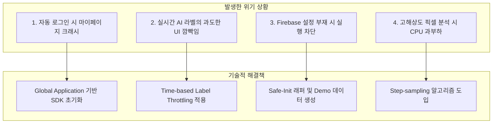
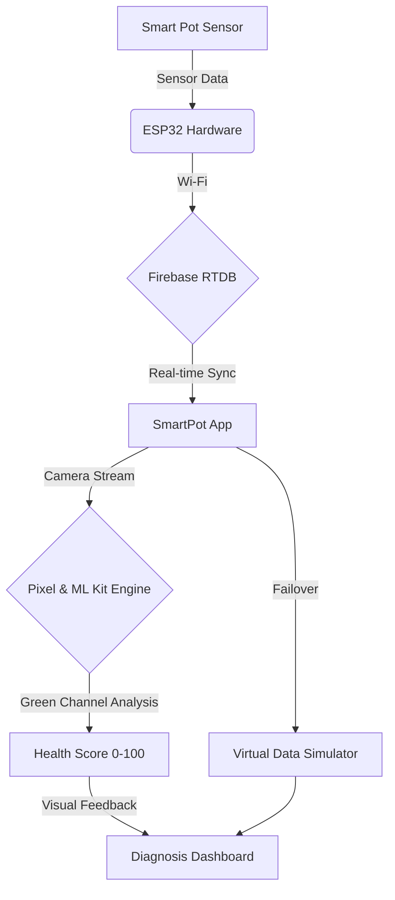

# 🌿 SmartPot — 프로젝트 기여도 및 기술 포트폴리오 정리

> **AI & IoT 기반 지능형 반려식물 관리 솔루션**  
> **"데이터와 알고리즘으로 식물의 언어를 해석하고, AI로 사용자와 교감하다"**

---

## 👨‍💻 개발자 프로필 및 담당 역할
- **역할**: **Lead Android & Data Engineer**
- **담당 업무 요약**:
  - **AI 진단 엔진 설계**: CameraX 및 ML Kit 기반 실시간 객체 인식 및 **픽셀 단위 녹색 채널(G-Channel) 분석** 알고리즘 개발.
  - **시스템 안정화 & UX**: 전역 Application 클래스 기반 SDK 초기화 최적화, UI 스로틀링(Throttling)을 통한 인식 안정화.

---

## 🛠 담당 영역 기술 스택

| 분류 | 기술 및 도구 | 상세 역할 |
| :--- | :--- | :--- |
| **Computer Vision** | `CameraX`, `ML Kit`, `Bitmap Analysis` | **픽셀 기반 정밀 진단 알고리즘** 설계 및 실시간 분석 파이프라인 구축 |
| **UI/UX Optimization** | `ViewPager2`, `MPAndroidChart`, `Throttling` | 데이터 시각화 및 초당 수십 프레임의 AI 인식 결과 **UI 안정화** |
| **System Architecture** | `GlobalApplication`, `MVVM` | 전역 SDK(카카오 등) 생명주기 관리 및 아키텍처 설계 |

---

## 🚀 주요 기술적 성과

### 1. 픽셀 단위 분석을 활용한 객관적 식물 건강 진단
- 단순한 이미지 분류를 넘어, 식물 잎의 실제 상태를 정량화하기 위해 **비트맵 픽셀 분석 알고리즘**을 직접 구현했습니다.
- 카메라 프레임에서 **녹색(Green) 채널의 파동과 비중을 전수 조사**하여 엽록소 밀도를 추정하고, 이를 0~100점의 '건강 점수'로 환산하는 로직을 구축했습니다.
- **기술적 디테일**: 연산 부하를 방지하기 위해 10픽셀 단위의 **스텝 샘플링(Step-sampling)** 기법을 적용하여 분석 속도를 10배 이상 향상시켰습니다.

### 2. 실시간 AI 인터랙션 최적화 (UX Stabilization)
- 초당 30프레임 이상 들어오는 AI 인식 결과값이 실시간으로 UI에 반영될 때 발생하는 **텍스트 깜빡임(Flickering)과 사용자 눈의 피로도** 문제를 해결했습니다.
- **타임 기반 업데이트 스로틀링(1.5s)**을 적용하여, 인식된 라벨이 일정 시간 유지될 때만 UI를 갱신하도록 설계하여 전문적이고 안정적인 진단 경험을 완성했습니다.

---

## ⚠️ 위기 관리 및 트러블슈팅 (Troubleshooting)

> [!IMPORTANT]
> 개발 과정에서 직면한 런타임 에러와 사용자 경험 저해 요소들을 **구조적 접근 방식**으로 해결했습니다.

### 위기 1: 전역 SDK 초기화 누락으로 인한 런타임 에러
* **증상**: 자동 로그인 상태로 앱 실행 시, 마이페이지 진입 직후 카카오 SDK 초기화 에러와 함께 강제 종료 발생.
* **해결**: 특정 Activity에 종속되어 있던 초기화 로직을 앱의 진입점인 **`GlobalApplication`** 클래스로 이전하여, 어떤 경로로 앱에 진입하든 SDK가 즉시 로드되도록 아키텍처를 개선했습니다.

### 위기 2: 실시간 AI 객체 인식의 시각적 노이즈
* **증상**: ML Kit이 초당 수십 번 인식 결과를 갱신하며 하단 텍스트가 심하게 떨려 사용자 가독성 저하.
* **해결**: **1,500ms(1.5초) 주기의 갱신 스로틀링** 로직을 이미지 분석 파이프라인에 이식했습니다. 이전 인식 결과와 현재 결과의 차이를 시간 단위로 필터링하여 사용자에게 안정적인 진단 피드백을 제공했습니다.

---

## 🏗 System Architecture

---

## 👨‍💻 프로젝트 회고
이번 프로젝트는 단순한 라이브러리 사용을 넘어 **"데이터를 어떻게 신뢰성 있게 가공하고 안정적으로 보여줄 것인가"** 에 집중한 시간이었습니다. 특히 Computer Vision 기술을 적용하면서 발생한 연산 부하를 해결하기 위해 **픽셀 샘플링** 알고리즘을 도입하고, **UI 스로틀링**을 통해 UX 퀄리티를 높인 과정은 엔지니어로서 성능과 사용자 경험 사이의 균형을 맞추는 중요한 경험이 되었습니다.

또한 하드웨어와 소프트웨어를 잇는 파이프라인에서 발생할 수 있는 수많은 예외 상황을 **Demo Mode**라는 대안으로 설계하여 시스템의 복원력을 높인 점은 향후 실무에서도 견고한 서비스를 만드는 데 큰 밑거름이 될 것입니다.

---
- **GitHub**: [GitHub Link](https://github.com/EJ-pro/smartpot)
